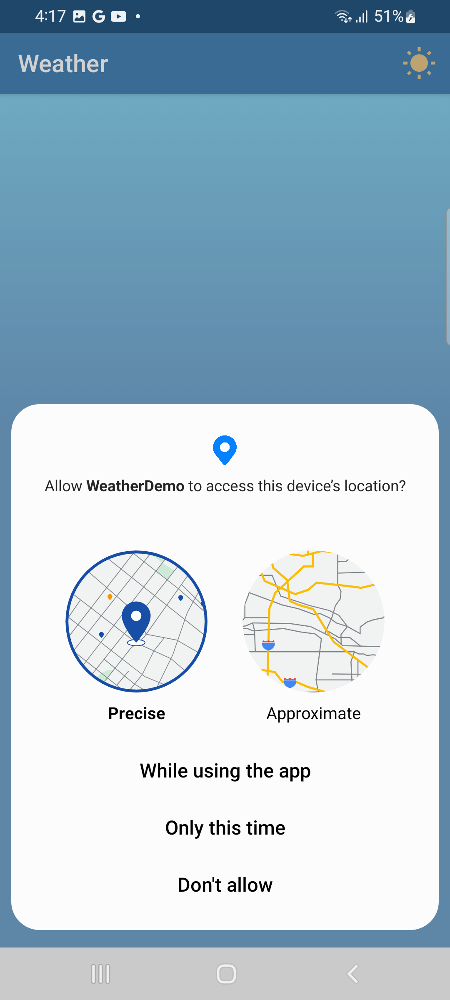
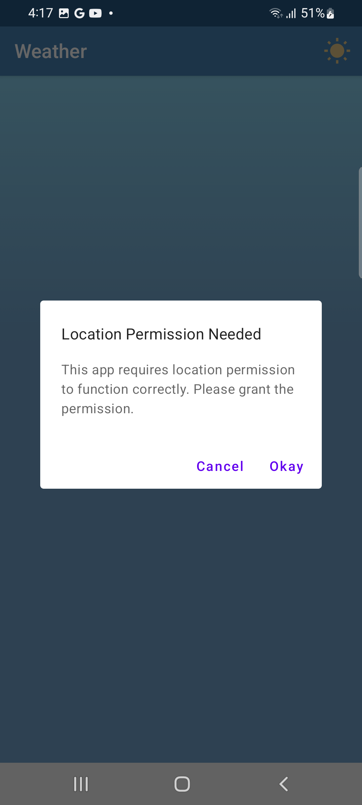
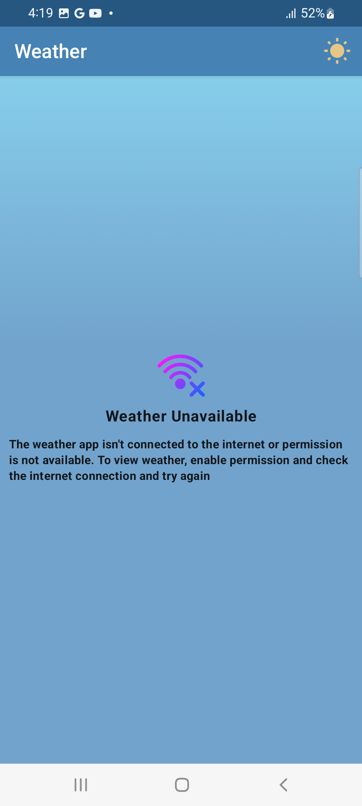

## WeatherApp

A simple weather application that displays the current weather based on the user's location. 
The app uses the OpenWeatherMap API to fetch weather data and provides a user-friendly interface with day and night themes.
The application is built using Kotlin and follows the MVVM architecture pattern.

### Features

- **Current Weather Display**: Shows the current weather of the user's location using data fetched from the OpenWeatherMap API.
- **Offline Support**: Displays the last seen weather information, including images and icons, even when offline.
- **Night Theme**: Automatically switches between day and night themes based on local time, with an option for manual toggling.
- **Modern UI**: A clean and intuitive user interface designed with Jetpack Compose, including relevant images and icons for different weather conditions.

### MAIN SCREEN

<table>
<tr>
<td>

Day Theme Screenshot

</td>
<td>

Night Theme Screenshot

</td>
</tr>
</table>

## Other Screens
<table>
<tr>
<td>

Request Permission

</td>
<td>

Alert

</td>
<td>

Error Screen

</td>
</tr>
</table>

### Tech Stack

- **Kotlin**: Widely adopted in Android development for its concise syntax and null safety.
- **Jetpack Compose**: Simplifies native UI development on Android with declarative Kotlin APIs.
- **Lifecycles**: Manage Android component lifecycles, enhancing app stability and organization.
- **ViewModel**: Maintains UI-related data across configuration changes in Android applications.
- **Dagger Hilt**: Reduces boilerplate code for dependency injection in Android projects.
- **Kotlin Coroutines**: Simplifies background tasks and concurrency in Kotlin-based Android apps.
- **Kotlin Flow**: Provides a sequential flow of data in Kotlin coroutines for reactive programming.
- **Retrofit**: Simple and powerful HTTP client for Android and Java/Kotlin applications.
- **Room Database**: Provides an abstraction layer over SQLite for robust database access in Android applications.

### API Usage

- **OpenWeatherMap API**: The app utilizes the OpenWeatherMap API to fetch current weather data.
- **API Key**: Replace the API key in AppConstants.API_KEY ="YOUR_API_KEY"

### Development Specifications

- **UI Design**: Implemented using Jetpack Compose.
- **Data Persistence**: Utilizes Room database to store weather data for offline access.
- **Network Operations**: Retrofit is used to handle network operations and fetch data from the OpenWeatherMap API.
- **Asynchronous Tasks**: Kotlin coroutines are used for managing asynchronous operations.
- **Architecture**: The application follows the MVVM (Model-View-ViewModel) architecture pattern.

### Project Structure

1. **MainActivity.kt**: The main activity of the application, handling UI interactions.
2. **Repositoryt**: Manages data operations, including fetching data from the API and storing it in the Room database.
3. **WeatherViewModel.kt**: ViewModel handling the business logic and data for the UI.
4. **UI Components**: Designed using Jetpack Compose for displaying weather data and themes.
5. **Database Entities and DAO**: Defines the data models and database operations for Room.

### Building the APK

To build the APK, ensure you have the necessary configurations in your environment. The application should compile and run with the provided API key for testing purposes.

### Creative UI Design

The app includes contextually relevant images and icons based on the weather conditions. The UI is designed to provide an aesthetically pleasing and intuitive user experience.

### App Flow 

[
